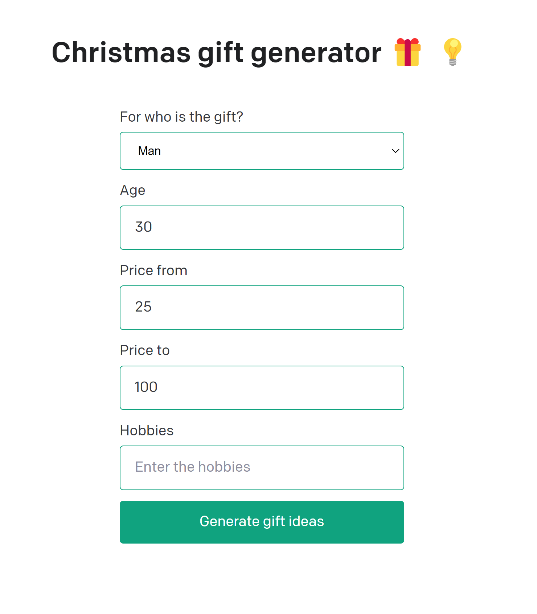

1. Add your [API key](https://beta.openai.com/account/api-keys) to the newly created `.env` file

2. Run the app

   ```bash
   $ npm install
   $ npm run dev
   ```

You should now be able to access the app at [http://localhost:3000](http://localhost:3000)

You will be able to get recommended Christmas gifts, after filling out the form.
Have fun!

### Form you need to fill out in order to generate Christmas gifts:


